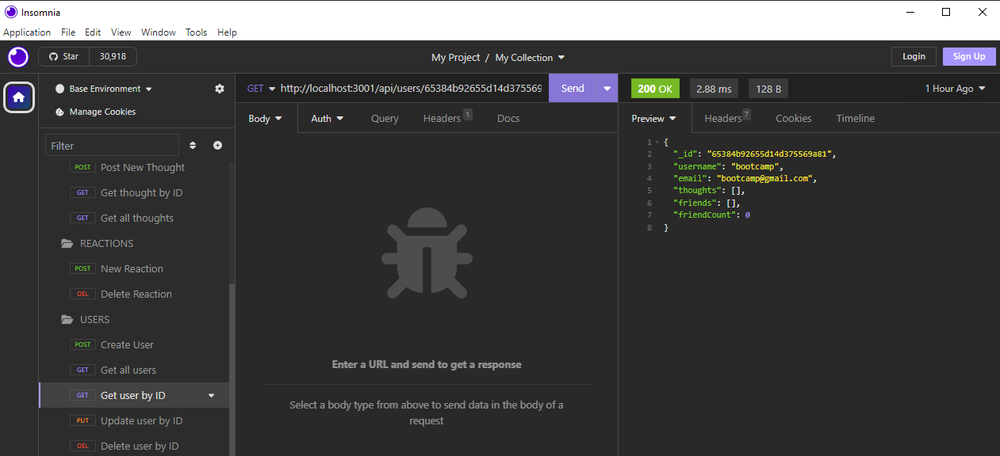
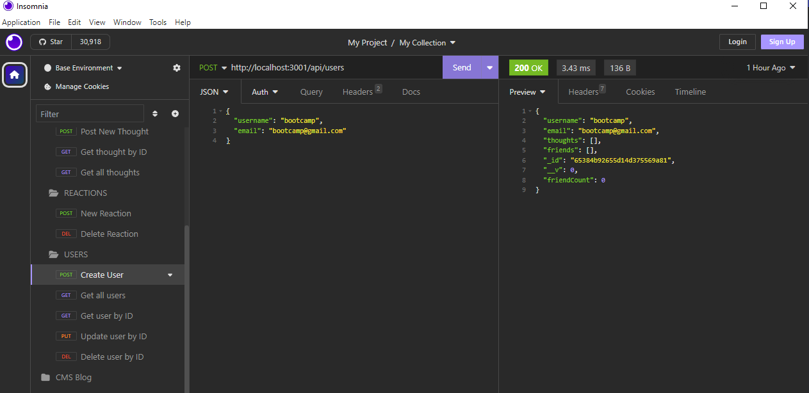

# Mongo-Social-Media-API

## Description


This is a social-media API built with NoSQL via MongoDB.

This project was built to demonstrate route functionality through MongoDB, and to experiment using NoSQL as a non-relational database. This API was built around a social-media esque prototype, where a developer can test Get, Post, Put, and Delete routes on various database items related to a social media application, such as Users, Thoughts, Friends and Reactions. These methods are similar to those used in MySQL and Sequelize, but with differing relational techniques. 

## Installation
Installation for this API is generally not necessary, as it's purely for dev testing purposes. However, feel free to clone this repository to your own device, and test the various methods using Insomnia, or your preferred API development platform.

Once cloned, run

```
npm i
```

to install all necessary packages required to run this software. Afterwards, run this command in the terminal:

```
node /index.js
```
to initialize the application.

## Usage
Once initialized, various routes can be tested. Routes that create or update the database will generally require JSON body text to function properly. 



```
Users
- Get all users: http://localhost:3001/api/users
- Get user by ID: http://localhost:3001/api/users/ID
- Create user: http://localhost:3001/api/users
- Update user by ID: http://localhost:3001/api/users/ID
- Delete user by ID: http://localhost:3001/api/users/ID
Thoughts
- Get all thoughts: http://localhost:3001/api/thoughts
- Get thought by ID: http://localhost:3001/api/thoughts/ID
- Create new thought: http://localhost:3001/api/thoughts
- Update thought by ID: http://localhost:3001/api/thoughts/ID
- Delete thought by ID: http://localhost:3001/api/thoughts/ID
Reactions
- New reaction: http://localhost:3001/api/thoughts/thoughtID/reactions
- Delete reaction: http://localhost:3001/api/thoughts/thoughtID/reactions/reactionID
Friends
- Add friend by ID: http://localhost:3001/api/users/SourceUser/friends/TargetUser
- Remove friend by ID: http://localhost:3001/api/users/SourceUser/friends/TargetUser
```
An instructional video on how to use insomnia to test these routes can be found [here.](https://youtu.be/7emmBSxHY1)

## Credits
 - [DayJS](https://day.js.org/), a JavaScript date utility library
 - [Mongoose](https://www.mongodb.com/cloud/atlas/lp/try4?utm_content=rlsavisitor&utm_source=google&utm_campaign=search_gs_pl_evergreen_atlas_general_retarget-nbnon_gic-null_amers-us-ca_ps-all_desktop_eng_lead&utm_term=online%20database%20software&utm_medium=cpc_paid_search&utm_ad=p&utm_ad_campaign_id=14291004605&adgroup=128837429227&cq_cmp=14291004605&gad=1&gclid=CjwKCAjw1t2pBhAFEiwA_-A-NOE5XKjxbtk2POA3pq8ijzk38LYY33Ho80WJysQ2EW_V2SLhBp6wYRoCRRMQAvD_BwE), a cross-platform document oriented database program
 - [Express](https://expressjs.com/), a back end web application framework. 
 - Documentation on Mongoose found [here.](https://mongoosejs.com/docs/)
 - Washington University's Coding Bootcamp Program

 ## License
 Please refer to the respective Github repository for license information. The repository can be found [here](https://github.com/andmell/Mongo-Social-Media-API).